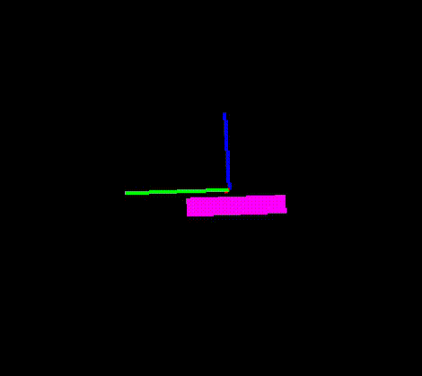

# wiimote_IMU

A sample of estimating wiimote orientation from gyroscopes and accelerometers data.
This sample uses the [wiiuse](https://github.com/wiiuse/wiiuse) library for Linux but it should be compatible with other libraries and other devices.
On older wiimotes, the wii motion plus extension is required to obtain gyroscope data.

Note that the wiimote does not contain a magnetometer so some drift along the "yaw" rotation will appear along the runtime.
A reset can be performed by pressing the B button.

⚠️ Wiiuse also seem to not provide gyroscope data in an event based manner. Accuracy may be then sub-optimal as the user cannot precisely guess the elaped time between two different gyroscope measure.  

🚨 Small parts of this code were generated using the public version of chatGPT and Gemini (09/2026).

  

# Dependencies

- OpenGL
- GLUT
- wiiuse <https://github.com/wiiuse/wiiuse>
- Eigen3 <https://libeigen.gitlab.io/>